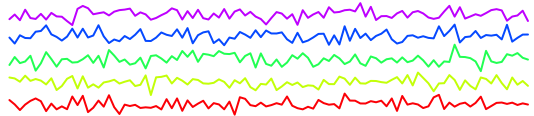

## Research

My research centers on the statistical challenges posed by highly structured data collected in an increasing number of applications ranging from imaging to wearable technologies. Frequently, the observed data are discrete samples of an underlying functional process which exhibits complex dependencies that are difficult to capture using traditional statistical models. Functional data analysis (FDA) offers a power methodological framework that embraces the underlying structure in this data by assuming that the basic unit of observation is a signal observed over some continuous domain. A central theme in my research is to provide computationally efficient methods for these rich data structures that maintain information along each dimension while simultaneously providing interpretable components and inferences. 

### Multi-modal brain imaging data

### 

My research is motivated by electroencephalography (EEG) studies in children with autism spectrum disorder conducted by collaborators at [The Jeste Developmental Neurophysiology Lab](http://jestelab.org/) and the [Autism Biomarker Consortium for Clinical Trials](https://medicine.yale.edu/ycci/researchers/autism/).

A list of publications and associated software is availaible [here](publications.md). 

[ [Back to homepage] ](./)

