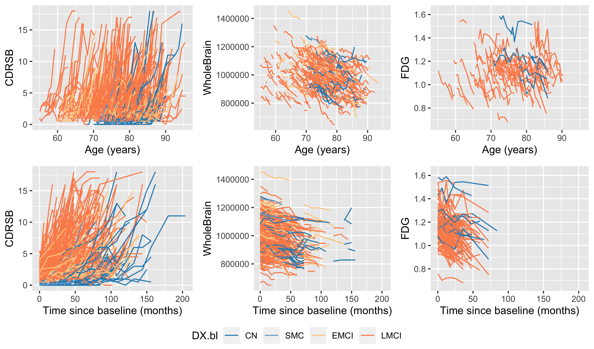
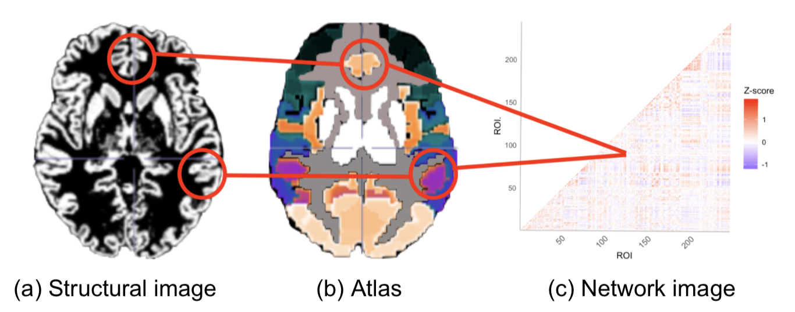
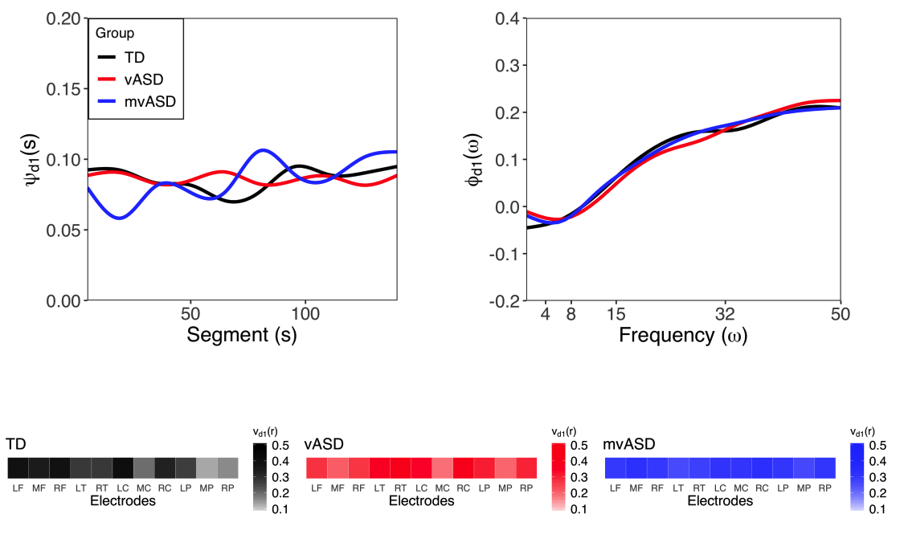

## Research

My research centers on the statistical challenges posed by highly structured data collected in an increasing number of applications ranging from imaging to wearable technologies. Frequently, the observed data are discrete samples of an underlying functional process which exhibits complex dependencies that are difficult to capture using traditional statistical models. A central theme in my research is to provide computationally efficient methods for these rich data structures that maintain information along each dimension while simultaneously providing interpretable components and inferences. Specific topics of active research are listed below.

### Disease progression models

Disease progression models (DPMs) are critical tools to characterize the etiology of neurodegenerative disorders (NDs) and capture treatment effects for prospective clinical trials. Development of DPMs is complicated by subject-level variability in age of onset, rate of progression, and signal amplitude. We develop Bayesian generalized nonlinear mixed effects DPMs which model disease progression across heterogeneous biomarkers
by modeling subject-specific variation in phase, amplitude, diease rate. 

### Multi-modal brain imaging data

Due to a global rise in life expectancy, Alzheimer's disease and other neurodegenerative disorders (NDs) represent a looming health crisis necessitating improvements in disease monitoring and treatment. NDs cause cognitive decline through disruption of structure and connectivity in healthy brains which can only be detected using brain images from multiple modalities. Specifically, images contain either structural information or network information which must be linked via joint models to provide principled clinical inference. However, there are few statistical models that integrate both types of information due to the difficult multimodal structure which includes high-dimensional signals, complex correlations, and heterogenous data types. This lack of appropriate methods not only limits the interpretation of clinical findings, but also has been shown to bias estimated effects, reduce statistical efficiency, and increase sensitivity to noise. To this end, hierarchical Bayesian methods allow structured information to be shared among brain images via their joint prior structure but have not been embraced due to a lack of theoretical guarantees, computational bottlenecks, and difficulty specifying prior structures. We develop novel Bayesian frameworks to address the theoretical, inferential, and computational challenges of jointly modeling multimodal brain images. Viewing multiple brain images as multi-objects, these methods exploit object topology while leveraging linkages among objects to perform inference, clustering, and prediction. These tools produce inference regarding the timing and ordering of biomarkers in disease progression and how this variation can be partitioned between subject-level risk factors and individual variation leading to informative inference as well as disease progression forecasting. Our current methods work explores novel covariance structure, extensions to time to event modeling, and addressing computational challenges that emerge when modeling high-dimensional multi-modal brain imaging data. 

### Functional data analysis of electroencephalography data

Functional data analysis (FDA) offers a power methodological framework that embraces the underlying structure in this data by assuming that the basic unit of observation is a signal observed over some continuous domain. My research is motivated by electroencephalography (EEG) studies in children with autism spectrum disorder conducted by collaborators at [The Jeste Developmental Neurophysiology Lab](http://jestelab.org/) and the [Autism Biomarker Consortium for Clinical Trials](https://medicine.yale.edu/ycci/researchers/autism/).

A list of publications is availaible [here](publications.md). 

[ [Back to homepage] ](./)

